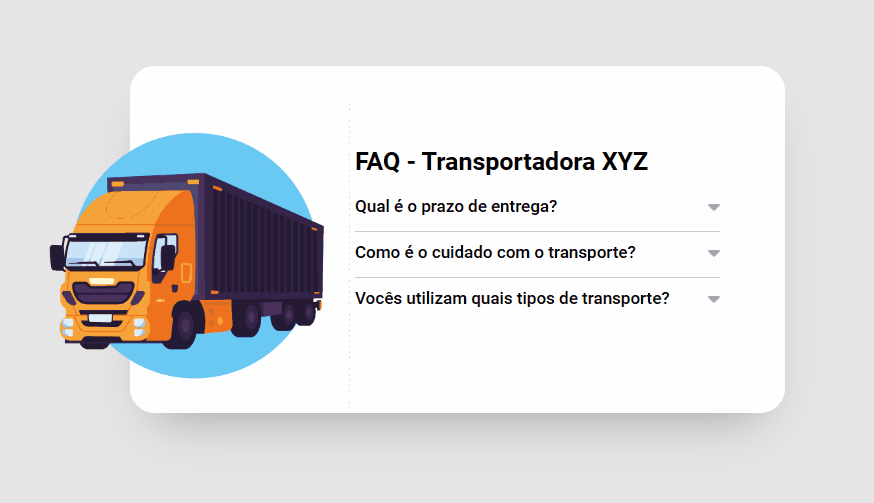

# Efeito Acordeon - FAQ

Exercício proposto de HTML + CSS + JS intermediário para criação de um efeito acordeon em uma seção de FAQ (perguntas frequentes) para o site da Transportadora XYZ.

## Tabela de Conteúdo

- [Desafio](#desafio)
- [Screenshot](#screenshot)
- [Ferramentas](#ferramentas)
- [Autora](#autora)

## Desafio

Para este projeto, o desafio foi utilizar o JavaScript para ocultar e mostrar a resposta da pergunta selecionada, alterando a estilização da pergunta ativa.

## Screenshot

## Ferramentas

- HTML com semântica
- Estilização com CSS
- JavaScript (DOM e funções)

## Autora

- LinkedIn - [Camila Katayama](https://www.linkedin.com/in/camila-katayama-ab1a42153/)
- GitHub - [@camilakataa](https://github.com/camilakataa)

